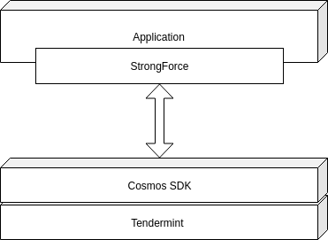

<p align="center">
  
</p>

___
<p align="center" >
 Smart Contracts Framework over Tendermint consensus
</p>
</br>


StrongForce is built on top of .Net core and provides a flexible smart contract framework for creating projects over Tendermint consensus and easily scaling them up thanks to the integration with Cosmos SDK.

</br>
</br>
<p align="center">
  
</p>


### Main/Strong features 

- **Smart Contracts** - full featured smart contracts framework over .Net Core 
- **Message Forwarding** - impersonate action execution through voting contracts and permissionded groups
- **Access Control List** - fine-tuned control over the addresses that can execute actions on your contracts

### Building blocks
- **Action** - characterizing an activity with basic properties of Origin (contract/address) it starts from, its Sender (contract/address) which might be different from the Sender in case of forwarding and Target - the end destination. An Action can be easily extended for creating specific activities that on their hand require special permissions or need particular functions to be executed on them. 

- **Contract** - a main element taking care of handling an action, redirecting it or executing the required functions on it. Each contract has unique address that distinguishes it and specify its place in the whole infrastructure.

- **ContractRegistry** - takes care of all contracts, their uniqueness in the ecosystem and handling the events they throw on executing or redirecting an action. 

- **AccessControlList** - controls which contracts have permissions to execute an action and adds/removes/delegate those permissions.

</br>

### Getting started
#### Prerequisites
- dotnet core
#### Build
```
cd SmartContracts.NET
dotnet build
```
#### Test
```
cd SmartContracts.NET
dotnet test
```

### Status

[](https://travis-ci.com/comrade-coop/strongforce)
